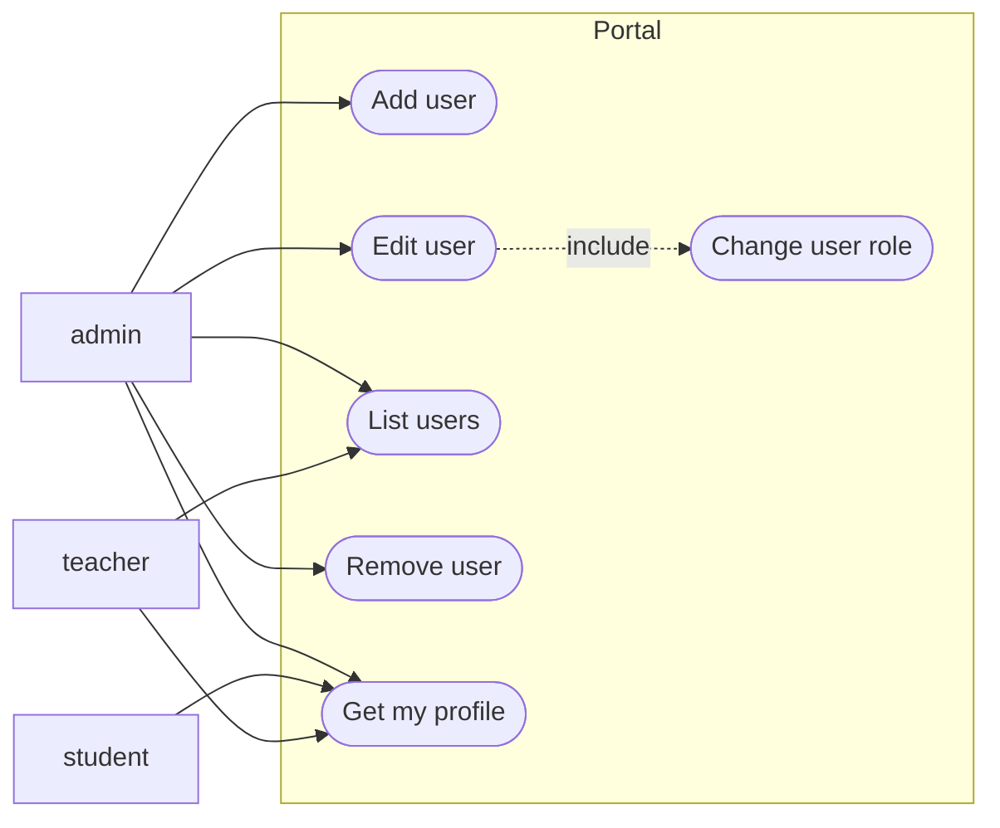
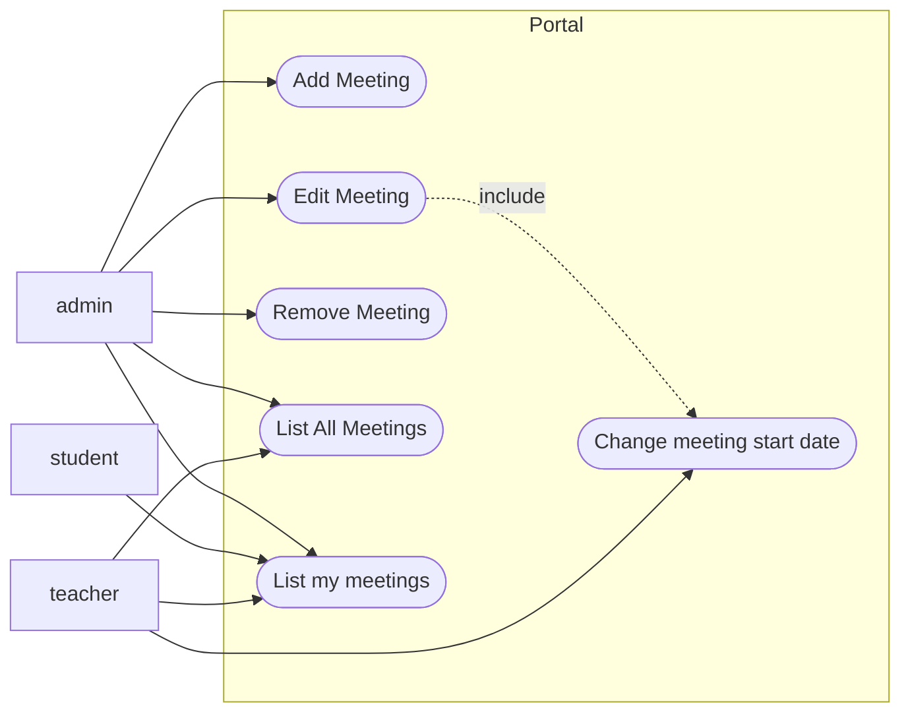

# Сценарии использования

```mermaid
flowchart LR
    subgraph Portal
    
    addUser([Add user])
    editUser([Edit user])
    changeUserRole([Change user role])
    listUsers([List users])
    removeUser([Remove user])
    getMyProfile([Get my profile])

    end
    
    admin[admin]
    student[student]
    teacher[teacher]
    
    admin --> addUser
    admin --> editUser
    admin --> listUsers
    admin --> removeUser
    editUser -. include .-> changeUserRole
    
    admin --> getMyProfile
    student --> getMyProfile
    teacher --> getMyProfile
    teacher --> listUsers
```

```mermaid
flowchart LR
    subgraph Portal
    
    addMeeting([Add Meeting])
    editMeeting([Edit Meeting])
    removeMeeting([Remove Meeting])
    listAllMeetings([List All Meetings])
    changeMeetingStartDate([Change meeting start date])
    listMyMeetings([List my meetings])

    end
    
    admin[admin]
    student[student]
    teacher[teacher]
    
    admin --> addMeeting
    admin --> editMeeting
    admin --> listAllMeetings
    admin --> removeMeeting
    editMeeting -. include .-> changeMeetingStartDate
    
    admin --> listMyMeetings
    student --> listMyMeetings
    teacher --> listMyMeetings
    teacher --> changeMeetingStartDate
    teacher --> listAllMeetings
```

```mermaid
flowchart LR
    subgraph Portal
    
    addMeeting([Add Meeting])
    editMeeting([Edit Meeting])
    removeMeeting([Remove Meeting])
    listAllMeetings([List All Meetings])
    changeMeetingStartDate([Change meeting start date])
    listMyMeetings([List my meetings])

    end
    
    admin[admin]
    student[student]
    teacher[teacher]
    
    admin --> addMeeting
    admin --> editMeeting
    admin --> listAllMeetings
    admin --> removeMeeting
    editMeeting -. include .-> changeMeetingStartDate
    
    admin --> listMyMeetings
    student --> listMyMeetings
    teacher --> listMyMeetings
    teacher --> changeMeetingStartDate
    teacher --> listAllMeetings
```